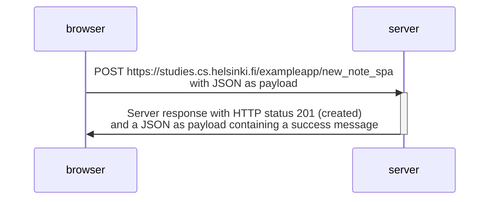

```mermaid
sequenceDiagram
participant browser
participant server

    browser->>server: POST https://studies.cs.helsinki.fi/exampleapp/new_note_spa <br/> with JSON as payload
    activate server
    server->>browser: Server response with HTTP status 201 (created) <br/> and a JSON as payload containing a success message
    deactivate server
```